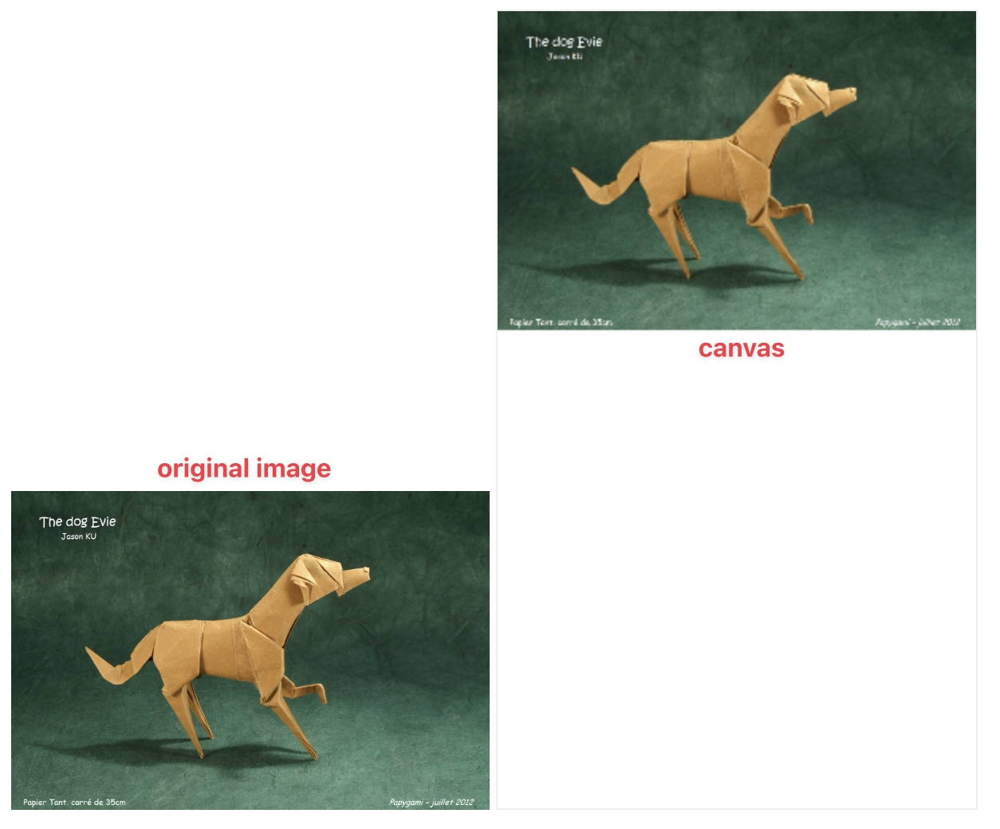
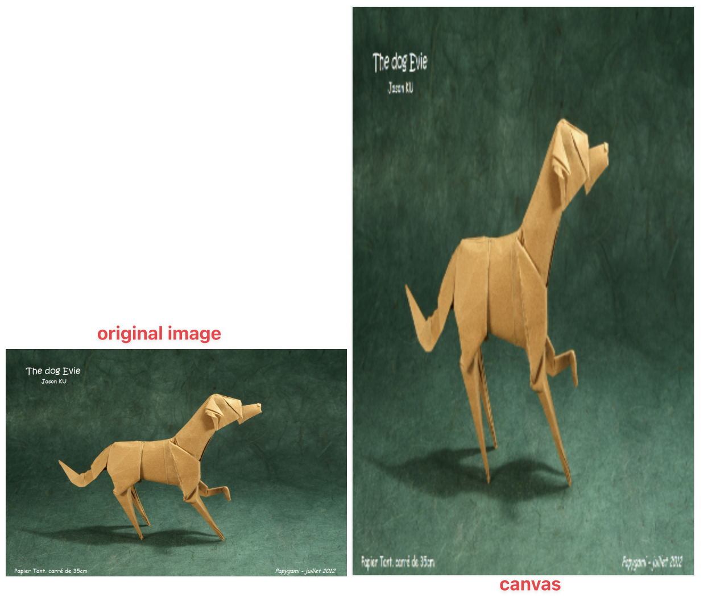

# Scale image to fit the canvas

## Solution 1

1. Get the width/height of image and canvas. We should use natualWidth and naturalHeight to measure for properly calculcation purpose. [Here is explaination why](https://developer.mozilla.org/en-US/docs/Web/API/CanvasRenderingContext2D/drawImage#:~:text=For%20example%2C%20if%20you%20load%20an%20Image%20and%20specify%20the%20optional%20size%20parameters%20in%20its%20constructor%2C%20you%20will%20have%20to%20use%20the%20naturalWidth%20and%20naturalHeight%20properties%20of%20the%20created%20instance%20to%20properly%20calculate%20things%20like%20crop%20and%20scale%20regions%2C%20rather%20than%20element.width%20and%20element.height.)

2. Get ratio between canvas and image

```
const ratioW = canvasW / imageW;
const ratioH = canvasH / imageH;
```

If ratio is greater than 1, it means the canvas is larger size than the image. Otherwise, the canvas should be smaller than the image.

3.

```
const ratio = Math.min(ratioW, ratioH);
```

Assume, the canvas is smaller than image, it can be smaller width or smaller height. We should fit to size width/height of canvas

Example:
Canvas: w = 5, h = 3
Image: w = 10, h = 5

```
const ratioW = canvasW / imageW = 0.5;
const ratioH = canvasH / imageH = 0.6;

const scaledImageW = ratio * imageW = 5;
const scaledImageH = ratio * imageH = 2.5;

ratio = 0.5
```

Same with scaling image to specified number, we scale both the width/height to `scale` number. This can be not actually fit the width/height but keep image nice with the ratio.

4. Draw image

### Full code:

```
const canvas = document.querySelector('canvas')
const ctx = canvas.getContext('2d')
const img = document.querySelector('img')

const imgW = img.naturalWidth;
const imgH = img.naturalHeight;

console.log('imgW', imgW);
console.log('imgH', imgH);

canvas.width = 300;
canvas.height = 500;

const canvasW = canvas.width
const canvasH = canvas.height

const ratioW = canvas.width / imgW;
const ratioH = canvas.height / imgH;

// Scale to min ratio
const ratio = Math.min(ratioW, ratioH);

// After scale image
const imgScaledW = imgW * ratio;
const imgScaledH = imgH * ratio;

ctx.clearRect(0, 0, canvas.width, canvas.height)

ctx.drawImage(img, 0, 0, imgW, imgH, 0, 0, imgScaledW, imgScaledH)
```

### Result:



## Solution 2

```
ctx.drawImage(img, 0, 0, imgW, imgH, 0, 0, canvasW, canvasH)
```

### Result:



## Demo online

[https://codepen.io/cuongle-hdwebsoft/pen/vYbdBNV](https://codepen.io/cuongle-hdwebsoft/pen/vYbdBNV)
